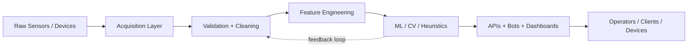

<div align="center">
  
</div>

<div align="center">
  <a href="https://git.io/typing-svg">
    
  </a>
</div>

<p align="center">
  <a href="https://github.com/IgorMitrofanov">
    
  </a>
  
  
  
</p>

## About Me

I design AI systems that have to survive outside notebooks: sensor streams, edge devices, CV pipelines, automation stacks, ML services, and deployment reality.

My focus is where data engineering, applied ML, embedded constraints, and systems thinking meet:

- production-ready AI and automation pipelines
- computer vision and signal processing for physical devices
- ML-backed analytics for weather, telemetry, and industrial data
- fast prototyping with Python, and performance-oriented tooling with Go
- LLM products, RAG systems, bots, and operator-facing internal tools

## Systems Snapshot



## Core Stack

<p align="center">
  
  
  
  
  
  
  
  
  
  
  
  
  
  
  
  
  
  
  
  
</p>

## Flagship Systems

| Project | What it does | Stack |
| --- | --- | --- |
| AI interview analysis platform | Upload-to-report workflow for interview and meeting recordings with transcription, GPT-powered analysis, bilingual reports, and persistent history | FastAPI, React/Vite, Whisper, LLM APIs, SQLite |
| Retrieval and support intelligence | Internal RAG systems over technical knowledge bases with vector search, dual-retrieval ideas, and operator-facing answer flows | Python, LangChain, Qdrant, Chroma, embeddings |
| 3D volume estimation from imagery | Photogrammetry and depth-based pipelines for point clouds, reconstruction, and object volume estimation from photos | OpenCV, Open3D, transformers, depth models |
| Industrial visual inspection | Real-time and offline CV experiments with YOLO and oriented bounding boxes for industrial object detection | Python, OpenCV, YOLO, PyTorch |
| Weather station and telemetry validation | Tools for station lookup, monthly validation, telemetry checks, and sensor-data quality control | Python, pandas, Meteostat, analytics, device data |
| Telegram automation products | Stateful bots for health, personality, and utility workflows with persistence and integration-oriented architecture | Python, aiogram, SQLite, PostgreSQL, Redis |

## What I Build

```text
AI services        -> model-backed APIs, bots, assistants, internal tools
Data pipelines     -> cleaning, validation, feature extraction, reporting
Edge intelligence  -> CV and telemetry logic near the device
Retrieval systems  -> embeddings, vector stores, search, grounded generation
Voice interfaces   -> transcription, chunking, speech-to-text-driven analysis
Infra glue         -> Docker, Linux, automation, deployment workflows
Applied research   -> turning experiments into systems that can be operated
```

## GitHub Analytics

<div align="center">
  <picture>
    <source
      srcset="https://github-readme-stats.vercel.app/api?username=IgorMitrofanov&show_icons=true&hide_border=true&count_private=true&include_all_commits=true&bg_color=00000000&title_color=38bdf8&text_color=cbd5e1&icon_color=38bdf8"
      media="(prefers-color-scheme: dark)"
    />
    
  </picture>
  <picture>
    <source
      srcset="https://streak-stats.demolab.com?user=IgorMitrofanov&hide_border=true&background=00000000&ring=38bdf8&fire=38bdf8&currStreakLabel=e2e8f0&sideNums=e2e8f0&currStreakNum=ffffff&sideLabels=94a3b8&dates=94a3b8"
      media="(prefers-color-scheme: dark)"
    />
    
  </picture>
</div>

<div align="center">
  <picture>
    <source
      srcset="https://github-readme-stats.vercel.app/api/top-langs/?username=IgorMitrofanov&layout=compact&hide_border=true&bg_color=00000000&title_color=38bdf8&text_color=cbd5e1"
      media="(prefers-color-scheme: dark)"
    />
    
  </picture>
  
</div>

<div align="center">
  
</div>

## Contribution Flow

<div align="center">
  <picture>
    <source media="(prefers-color-scheme: dark)" srcset="https://raw.githubusercontent.com/IgorMitrofanov/IgorMitrofanov/output/github-contribution-grid-snake-dark.svg" />
    <source media="(prefers-color-scheme: light)" srcset="https://raw.githubusercontent.com/IgorMitrofanov/IgorMitrofanov/output/github-contribution-grid-snake.svg" />
    
  </picture>
</div>

## Engineering Mindset

> Build useful systems. Make them observable. Keep them fast. Make them survive contact with production.

<div align="center">
  
</div>
